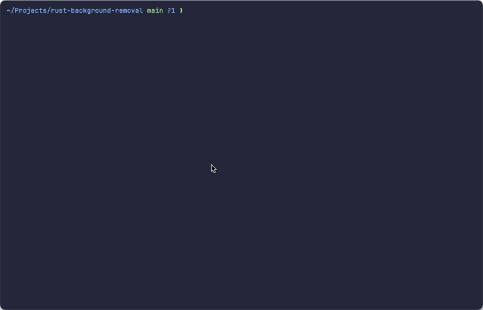

# AI Commit Message `acm`

A dead-simple AI-powered CLI tool for effortlessly crafting meaningful Git commit messages.



## Features

- Effortlessly create meaningful commit messages
- Supports the [Conventional Commits standard](https://www.conventionalcommits.org)
- Customizable prompts
- JSON mode support
- Compatible with various LLM API providers, including [OpenAI](https://openai.com), [OpenRouter](http://openrouter.ai), [Together AI](https://www.together.ai), [Anyscale](https://www.anyscale.com), and more

## Installation

Before installing `acm`, please ensure that you have [git](https://git-scm.com) installed on your system.

### Via Cargo

To install `acm` from source using `Cargo`, run the following command:

```sh
cargo install --locked acm-cli
```

### Via Homebrew

```sh
brew install dnanhkhoa/tap/acm
```

## Usage

To generate a commit message and commit your changes, simply use `acm` as a replacement for `git commit`:

```sh
# Stage your changes
git add <files...>

# Generate a commit message and commit your changes
acm
```

## License

`acm` is licensed under the [Apache License 2.0](https://choosealicense.com/licenses/apache-2.0/)
